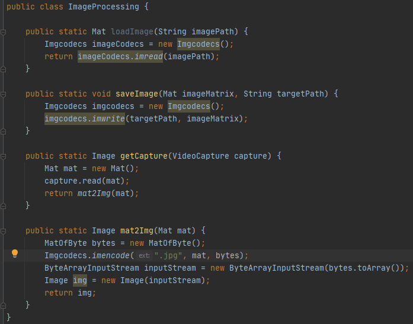
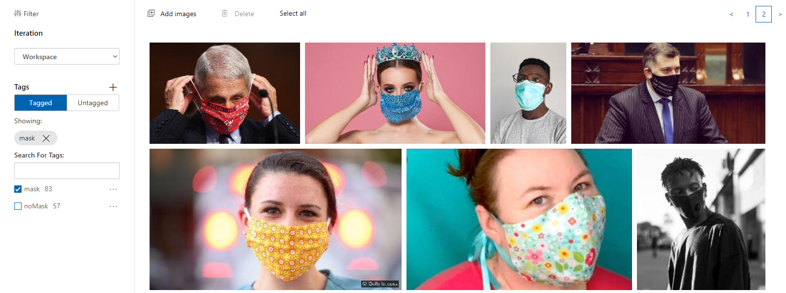
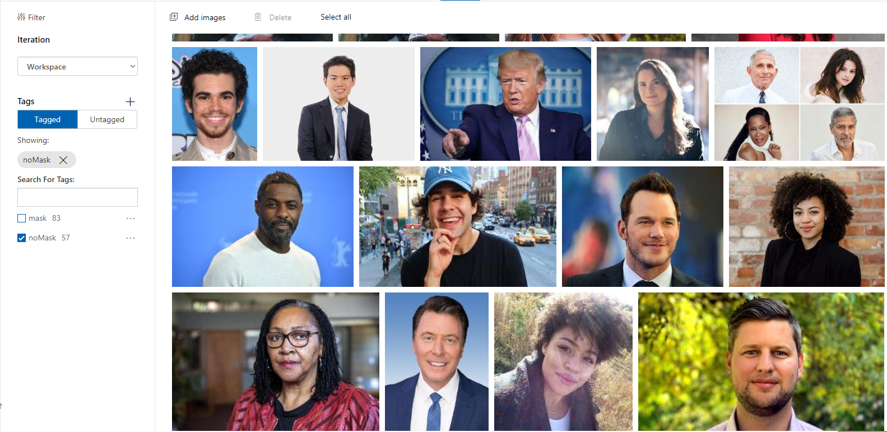
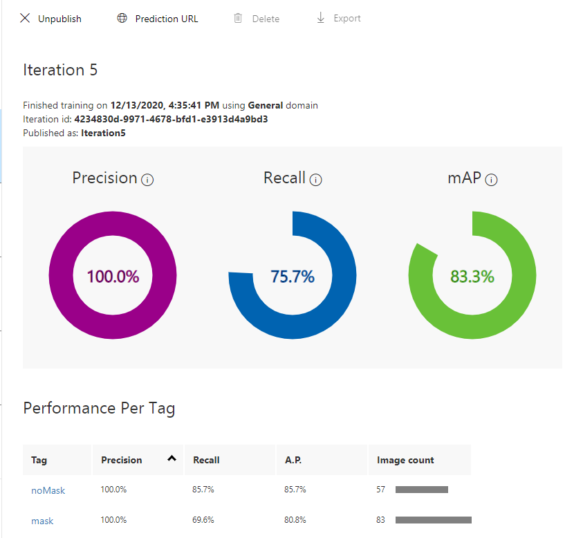
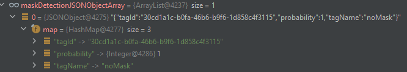
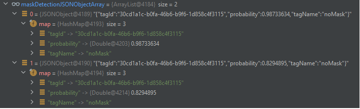
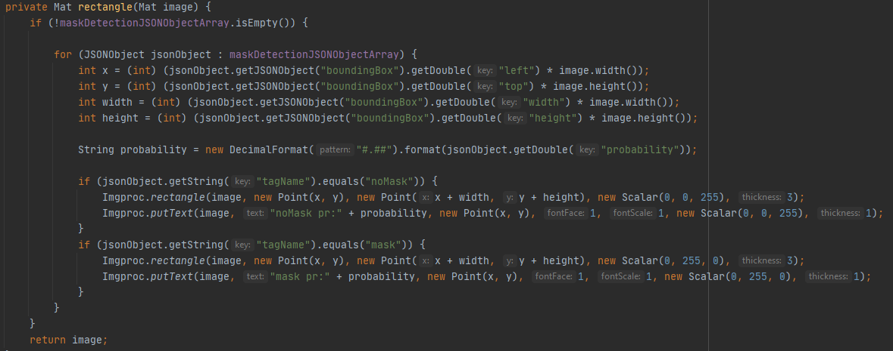

# Mask Detection

### YouTube video

https://youtu.be/rGGnJDnZrU4

### UseCase
The project realizes a covid mask detection from real time camera. 

### Used services
- CustomVision
- OpenCV library

### Creation process
To access to netbook camera and update the image used OpenCv library.

It's possible to get a camera snapshot or to get camera images in real time. In the project I prepared a mask detection in real time. 

To create mask detection algorithm used **Custom Vision** Azure service. 

Mask detection is realized in two Custom Vision models.
Custom Vision service provides 2 types of model: Object Detection and Classification. Object Detection engine allows search for a pre-defined object in the image. 
Classification allows to define the image type using predefined tags. 

Depending on the Custom Vision model type, image sending to the service is different. You find explanation in next chapters. 

#### Classification

The first step is creation tags and added images to teach algorithm how match the image to proper group. To "mask" tag added pictures which presents people with masks.

For "noMask" tag defined pictures of people without masks.

After model training CustomVision service is ready to use. CustomVision model must be published to get the URL and secret key that enables the trained model to be used.
 

**Precision** - This number will tell you: if a tag is predicted by your model, how likely is that to be right?

**Recall** - This number will tell you: out of the tags which should be predicted correctly, what percentage did your model correctly fine?

**mAP** - (mean average precision) This number will tell you: the overall object detector performance across all the tags

After first tests, model should be re-train based on the new images sources.
After each iteration, the model should become better. The condition is that the tags are assigned to the images correctly.
Incorrect assigment may spoil the model - be careful during tag assigment!

The application using OpenCv library detect and cut a face area from camera snapshot. The face image is send to Custom Vision and the JSON response contain defined tag and probability score.

The response is filtering out from all tags with a probability below the threshold (0.5).
We can define a threshold according to the needs.

According to response tags, the object is defined as "mask" or "noMask" and mark in green or red square.

To recap, in classification type version, face detection is realized by OpenCV library and Custom Vision is only used to mark that face is with or without mask.
Unfortunately FaceAPI Azure service has problem with recognizing faces with a mask, so I chose the OpenCv Library which has less hassle.
The troubles start when we have more that one face in camera snapshot. Then each face image must be sent to Custom Vision as separate HTTP request. Unfortunately, this causes high delays.
 

#### Object Detection

The first step is adding the images and indicate the object to detection - algorithm learn what object should search for. 
The next steps are similar - the more iteration, the model is better.

In Object Detection version each image from camera is sent to Custom Vision. There algorithm recognize predefined objects and return amount of detected objects with probability and location points.

The response is also filtering out above the threshold.

Rectangle method provides draw rectangle around a face based on location points from JSON response. 

To recap, in Object Detection model type the image from camera snapshot is sent in all and Custom Vision algorithm is responsible for detection object as face with or without mask.
If in the image we can see more than faces, still only one HTTP request is send to the service and in response we get a few detected object. So, it's more optimal in comparison to Classification model type
where each face object is sent singly.

